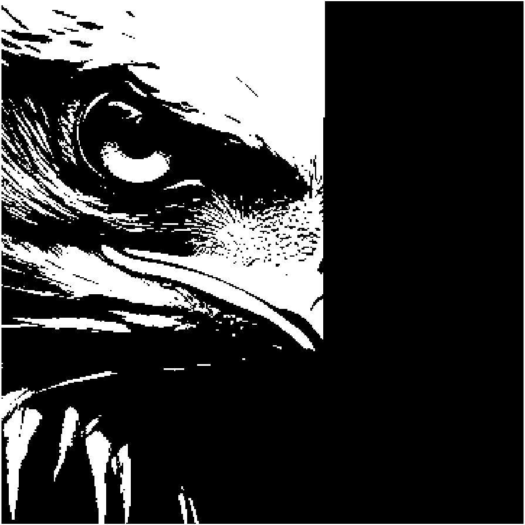

# Отчет к домашнему заданию №1: Базовый OFDM приёмник-передатчик

## Квинтэссенция работы
В этой работе реализован базовый OFDM приёмник и передатчик в среде программирования Matlab. Пайп лайн сигнала можно увидеть на рисунке №1. В качестве файла для передачи используется картинка орла (рисунок №2), которая перводится в битовый формат и затем уже производится QAM-модуляция. При успешном приёме, реализован вывод полученной части картинки.

**Параметры OFDM передачи**
* Сигнальное созвездие: `16QAM`;
* Длительной полезной части в количестве fft отсчётов: `N_fft = 1024`
* Количество поднесущих в одном OFDM символе: `N_carrier = 400`
* Длина защитного интервала: `T_Guard = Nfft/8`
* Количество кадров: `Amount_OFDM_Frames = 10`
* Количество генерируемых OFDM символов: `Amount_OFDM_Symbols_per_Frame = 5`
* Количество пилотных поднесущих (процент от полосы):
`Percent_pilot = 25`
* Амплитуда пилотных значений:
`2*максимальная_амплитуда_созвездия`

_Рисунок №1. Пайплайн OFDM-системы_

_Рисунок №2. Передаваемая картинка_
## Cтруктура OFDM-символа
* Защитный интервал: это часть сигнала, вставляемая между символами OFDM для сохранения возможности демодуляции OFDM-сигнала в присутствии многолучевых помех, таких как отражения сигнала и разные задержки лучей этого сигнала. Защитный интервал обеспечивает ортогональность между символами, позволяя правильно разделять их в приемнике. То есть защитный интервал служит неким окном, в течение которого символы разных лучей могут интерферировать между собой, но уже в полезной части символа (на рисунке №2 - T_useful) гарантируется отсутствие этой интерференции. Соответственно, минимальная длительность защитного интервала выбирается исходя из максимальной задержки в рассматриваемом канале. В данной работе защитный интервал реализован в виде копии конечной части символа OFDM, добавляемой в начало этого же символа (cyclic prefix).

_Рисунок №3. Схема добавления защитного интервала по принципу циклического префикса_
* Data carriers: это поднесущие, которые передают фактические данные. Каждая поднесущая содержит в себе информацию об IQ-точке из общего потока данных.
* Pilot Carriers: это поднесущие, которые содержат в себе известные значения для осуществления оценки канала и эквалайзинга на приемнике. Пилоты встраиваются в сигнал вместе с данными на этапе формирования полосы сигнала. Они обеспечивают контрольные точки для определения канальной характеристики и её компенсации.
* Null Carriers _(опционально)_: в некоторых системах OFDM определенные поднесущие могут не использоваться для передачи данных или контрольных символов. Эти нулевые несущие помогают в дальнейшем уменьшении помех между соседними поднесущими.

_Рисунок №4. Структура OFDM-символа в частотной области_

## АЧХ сигнала на основе OFDM
На рисунке № 5 представлен график амплитудно-частотной характеристики (АЧХ) OFDM-сигнала. Сама АЧХ построена по уже сформированному OFDM-сигналу во времённой области путём взятия прямого пробразования Фурье. Как можно видеть, амплитуды сильно искажены, если сравнивать с амплитудами на рисунке 4, например. Помимо того, присутствует внеполосовое излучение гладкая "ванная" с правой стороны. Эти эффекты можно объяснить тем, что теперь при взятии преобразования Фурье расстояние между поднесущими уменьшается `(1/(Nfft+T_Guard))` и уже не попадает точно в изначальные целые частоты `(1/(Nfft))` - нарушение ортогональности между поднесущими (ICI).

_Рисунок №5. АЧХ OFDM-сигнала_

## АЧХ и сигнальное созвездие на этапе «получение точек созвездия»
Рассмотрим всего 4 случая (case): 
1. Идеальная временная синхронизация - когда позиция начала полезной части OFDM-символа определяется точно;
2. Ситуация, когда начало полезной части OFDM-символа определено внутри символа с задержкой в _`-n`_ отсчётов.
3. Ситуация, когда начало полезной части OFDM-символа определено внутри символа с задержкой в _`-k`_ отсчётов, где $k>T_G-\tau_{max}$ - т.е. появляется эффект многолучевого распространения;
4. Ситуация, когда начало полезной части OFDM-символа определено с задержкой в _`n`_ отсчётов - полезная часть захватывает отсчёты другого символа (ISI).

_Рисунок №6. Различные случаи временной рассинхронизации_

Все эти случаи показаны на `рисунке №6`. Теперь же посмотрим на АЧХ и сигнальное созвездие для каждого случая, за исключением 3, характерные изменения в сигнале можно получить комбинацией других случаев.

### Случай 1. Идеальная временная синхронизация

_Рисунок №7. АЧХ при идеальной временной синхронизации_

_Рисунок №8. Сигнальное созвездие при идеальной временной синхронизации_

Как и ожидалось, сигнальное созвездие является эталонным созвездием для выбранного типа модуляции - 16QAM, а АЧХ в точности совпадает с графиками рассмотренными ранее, например, на рисунке №4.

### Случай 2. Задержка в _`-n`_ отсчётов.

_Рисунок №9. АЧХ при задержке в `-n` отсчетов_

_Рисунок №10. Сигнальное созвездие при задержке в `-n` отсчетов_

Как можно видеть, АЧХ не проявляет каких-либо видимых изменений, в то время как сигнальное созвездие "закрутилось". Из курса по одночастотной связи известно, что такое происходит при "частотной рассинхронизации", однако откуда же взялась "частотная рассинхронизация", если мы рассматриваем временную?

_Рисунок №11. Объяснение случая №2: задержка в `-n` отсчетов_

Как можно видеть, на рисунке №11, наша задержка в $\delta$ отсчетов при взятии преобразования Фурье оказалась в степени экспоненты, умножаясь на номер отсчёта, отсюда и получаем эффект "частотной рассинхронизации". 
**Таким образом, задержка в `-n` отсчетов приводит к частотному сдвигу и как мы увидим далее - пожалуй, это наиболее легко компенсируемый случай временной рассинхронизации.**

### Случай 4. Задержка в _`n`_ отсчётов.

_Рисунок №15. АЧХ при задержке в 1 отсчёт_

_Рисунок №16. Сигнальное созвездие при задержке в 1 отсчёт_

_Рисунок №17. АЧХ при задержке в T_Guard/2 отсчётов_

_Рисунок №18. Сигнальное созвездие при задержке в T_Guard/2 отсчётов_

_Рисунок №19. АЧХ при задержке в T_Guard отсчётов_

_Рисунок №20. Сигнальное созвездие при задержке в T_Guard отсчётов_

Как можно видеть на графиках АЧХ для трёх случаев задержки синхронизации, амплитуды начинают изменяться и "прыгать". Сигнальные созвездия сначала "закручиваются", а потом и меняются по амплитуде своих точек. Таким образом, наблюдаются как фазовые сдвиги, так и амплитудные скачки. Можно предположить, что это происходит в силу межсимвольной интерференции (ISI). Убедимся в этом:

_Рисунок №21. Объяснение происходящего при задержке в _`n`_ отсчётов_

**В последней строке наших выкладок (рисунок 21) второй член говорит о наличии интерференции между поднесущими - нарушение ортогональности между поднесущими. А третий член в этой же последней строке свидетельствует о присутствии межсимвольной интерференции (ISI).**

**Таким образом, задержка синхронизации приводит к межсимвольной интерференции (ISI) и нарушению ортогональности между поднесущими (ICI).**

И напоследок, вот что получится, если идеально всё скомпенсировать (рисунок 22):

_Рисунок №22. Принятая картинка_